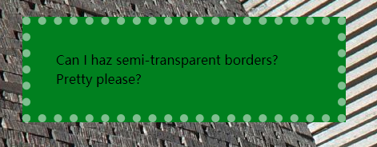

# css揭秘网页设计经典难题

#### 1.半透明边框

> 难题描述：默认情况下背景会延伸到边框所在区域下层，如图（2-3）。若设置白色背景和半透明边框，由于背景会透出边框，难以分辨。

    border: 10px solid hsla(0,0%,100%m.5);
    background: white;
    
如果不希望背景侵入背景边框所在的范围，可以把backgroung-clip设为padding-box

        border: 10px solid hsla(0,0%,100%m.5);
        background: white;
        backgroung-clip: padding-box
        
        
        
        
