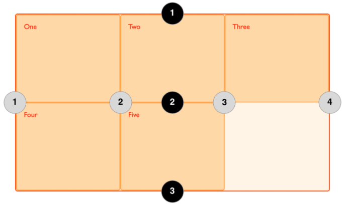

# 网格布局

<b>网格容器</b>

通过在元素上声明 display：grid 或 display：inline-grid 来创建一个网格容器。一旦我们这样做，这个元素的所有直系子元素将成为网格项目。

<b>网格容器</b>

通过 grid-template-columns 和 grid-template-rows 属性来定义网格中的行和列。这些属性定义了网格的轨道。一个网格轨道就是网格中任意两条线之间的空间。若只定义了列，则会让网格按所需的内容创建行。

<b>fr单位</b>

轨道可以使用任何长度单位进行定义。 网格还引入了一个额外的长度单位来帮助我们创建灵活的网格轨道。新的fr单位代表网格容器中可用空间的一等份，如
    
    grid-template-columns: 1fr 2fr 1fr;

表示把网格容器可用宽空间分成4等分，第一第三轨道为一等分，第二轨道为二等分。如下

    grid-template-columns: 500px 1fr 2fr;
    
表示第一个轨道是500像素，这个固定宽度被从可用空间中取走。剩下的空间被分为三份，按比例分配给了两个弹性尺寸轨道。

<b>在轨道清单中使用repeat()</b>

Repeat 语句可以用于重复轨道列表中的一部分。

    grid-template-columns: 1fr 1fr 1fr;
    grid-template-columns: repeat(3, 1fr);   // 与上面相同，表示重复1fr 3次
    
    grid-template-columns: 20px repeat(6, 1fr) 20px; // repeat也可以只用一部分，表示20像素，接着重复了6个1fr的轨道，最后一个20像素的轨道
    
<b>隐式或显示网格</b>
    
显示就是你用grid-template-columns 和 grid-template-rows定义的网格，而当增加内容网格自动创建行和列的表示隐式网格。grid-auto-rows 属性用来设置在隐式网格中的轨道高度。

<b>轨道大小minmax()</b>

设置最大最小值，比如设置 grid-auto-rows: minmax(100px, auto); 表示最小轨道的高度为100px，最大自动根据内容设置。

<b>网格线</b>
    
前面我们用的grid-template-columns和grid-template-rows都是轨道布局，我们也可以用网格线布局。grid-column-start和grid-column-end属性可以合并为 grid-column，grid-row-start和grid-row-end则合并为grid-row。如下为网格线编号，这个编号顺序取决于书写模式。grid-area为上面的四个属性的合写,顺序与margin的顺序相反。

如下，box1从列线1开始，延伸至列线4，也就是我们这个例子中最右边的列线。并从行线1延伸到行线3，占据了两个行轨道。第二个元素从列线1开始，延伸了一个轨道。因为这是默认行为，所以我不用指定结束线。并且它从行线3到行线5，跨越了两个行轨道。剩下的元素会把自己安放到网格空余的空间中。

    

       
One

       
Two

       
Three

       
Four

       
Five

    

    /************************************/
    .wrapper { 
        display: grid; 
        grid-template-columns: repeat(3, 1fr); 
        grid-auto-rows: 100px; 
    } 
    .box1 { 
        grid-column-start: 1; 
        grid-column-end: 4; 
        grid-row-start: 1; 
        grid-row-end: 3; 
    } 
    .box2 { 
        grid-column-start: 1; 
        grid-row-start: 3; 
        grid-row-end: 5; 
    }

<b>网格间距</b>

在两个网格单元之间的网格横向间距或网格纵向间距可使用grid-column-gap和grid-row-gap属性来创建，或者直接使用两个合并的缩写形式grid-gap设置大小。

<b>命名网格区域</b>

grid-area除了可以用网格线编号定义区域，还可以用于给区域命名。为了创建如下的布局，我们先命名区域然后用grid-template-areas定义区域；

    .header {
        grid-area: hd;
    }
    .footer {
        grid-area: ft;
    }
    .content {
        grid-area: main;
    }
    .sidebar {
        grid-area: sd;
    }
    
    .wrapper {
        display: grid;
        grid-template-columns: repeat(9, 1fr);
        grid-auto-rows: minmax(100px, auto);
        grid-template-areas: 
          "hd hd hd hd   hd   hd   hd   hd   hd"
          "sd sd sd main main main main main main"
          "ft ft ft ft   ft   ft   ft   ft   ft";
    }
    
    /******************************************/
    

        
Header

        
Sidebar

        
Content

        
Footer

    

    
